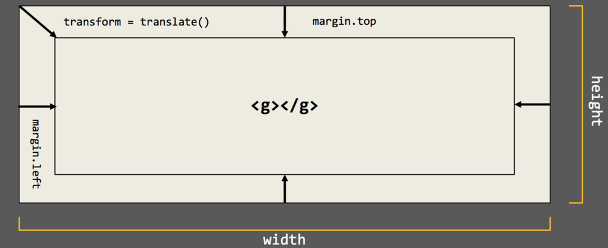

# Basic d3.js

Create a static graphic using [d3.js](https://d3js.org/).

---

### Simple Server Setup

We need to start up a local development server to serve static files like our JavaScript files, CSS stylesheets and CSV data.

##### Step 1

Open up a command prompt.

##### Step 2

Navigate to the directory where you downloaded and unzipped this repository. You'll use the command `cd <folder path>` to navigate the directory tree. (Helpful hint: `cd ..` takes you back up the directory tree one folder.) For example, if you unzipped this directory in a folder called `my_folder`:

```
$ cd my_folder/nicar-d3-2017/basic
```

##### Step 3

Start your simple server from the directory.

Python 2.x
```
$ python -m SimpleHTTPServer
```

Python 3.x

```
$ python -m http.server
```

You're good to go! Open your browser to [localhost:8000](http://localhost:8000/).

---

## Preflight

Notice the directories.

```
basic/
  index.html
  js/
    script.js
  css/
    styles.css
  data/
    oecd_health_data.csv
```

We'll write the code for our d3 chart in the `js/scripts.js` file.

## Part 1: The furniture

### Defining chart dimensions

First, we need to define the size of our chart. In most d3 examples, you'll see that done using a pattern like this:

```js
var margin = {
      top: 20,
      right: 60,
      bottom: 30,
      left: 100
    },
    width = 600 - margin.left - margin.right,
    height = 450 - margin.top - margin.bottom;
```

These are just JavaScript objects and variables. We aren't using d3 at all here, yet.


### Scales

Scales translate numbers in one range into numbers in another.

Every scale has a **domain** and a **range**.

The **domain** represents the values in your data.

The **range** represents the pixel positions of data points in your chart.

A scale translates a number in the domain to an equivalent one in a range. For example:


At the top of our chart, we don't yet know our domain, but we do know the range. So we can define scales for both our x and y axis like this:

```js
var x = d3.scaleLinear()
    .range([0, width]);

var y = d3.scaleLinear()
    .range([height, 0]);
```

### Axes

Axes are shortcut functions in d3 used to draw all the component parts of a chart's x and y axes.

```js
var xAxis = d3.axisBottom(x)
    .tickFormat(function(d) {
      return d + '%';
    });

var yAxis = d3.axisLeft(y);
```

Notice we also added a `tickFormat` function to correctly format the labels for our ticks on the x axis as percents.

### SVG

```js
var svg = d3.select(".chart").append("svg")
    .attr("width", width + margin.left + margin.right)
    .attr("height", height + margin.top + margin.bottom)
  .append("g")
    .attr("transform", "translate(" + margin.left + "," + margin.top + ")");
```



## Part 2: Data

### Getting your data

```js
d3.csv('data/oecd_health_data.csv', function(error, data) {
  // Chart code can use data here!
});
```

### Preparing your data
```js
data.forEach(function(d){
  d.x = +d['gdp_spending_2014'];
  d.y = +d['life_exp_2014'];
});
```
